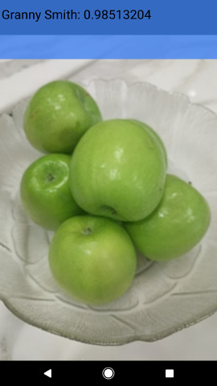

# Blind Vision

In this project we built a mobile assistant appfor visually impaired people. The app runs completely of-fline on the mobile device, it includes a deep convolutional neuron  network  for  precise object detection,  and  have  a  way  to represent  picture  content  with  sound.

## Description

WITH the recent  development  of  mobile  chips,  wenow see more and more powerful smart phone inpeople’s hand, processors inside these phones has morecomputing  power  than  normal  desktop  PC  in  2000.This  means  a  lot  can  be  done  on  mobile  devices  thatcould  make  people’s  life  easier.  Especially,  nowadaysmainstream  mobile  operating  systems  including  iOSand  Android  had  carefully  thought  after  accessibilityfunctions   build   in.   With   these   functions,   visuallyimpaired   people   can   use   a   smart   phone   almost   asconveniently as fair sighted people. However, there hasyet  to  be  a  good  app  to  help  them  ”see”  the  world,so  the  main  motivation  behind  this  project  is  to  helpvisually  impaired  people  to  ”see”  through  the  lens  oftheir smart phone.The first aspect of the project is to have a mechanismthat run on the phone and detecting faces continuously,to make the most use of it in any environment, ideally this  function  should  run  completely  offline  and  do  notrequire  any  cloud  service.  In  that  way,  the  user  canuse it when there is no network connection, and it alsohelps  with  minimising  delays.  In  the  short  period  ofthis  project  we  wanted  to  implement  face  detectingand  gender  classification,  and  build  that  with  futurefunctions  in  mind,  so  that  the  app  can  be  relativelyeasily expended to be able to recognise other things inthe future, for example identify people.Instead of using the traditional method of Egen facesand Fisher faces, we want to use some new method thatcan work when the people are not perfectly facing thecamera,  because  that  is  the  situation  we  have  in  mostof  the  use  cases.  We  tried  to  explore  the  possibilityof  using  a  deep  learning  method  called  ConvolutionalNeuron   Network(CNN)[7]   for   our   purpose.   Furthermore,  we  tried  not  to  use  a  CNN  that  is  specificallytrained  for  our  task,  instead,  we  want  to  use  a  CNNtrained  for  general  purpose  and  extract  features  fromit’s  result  to  achieve  our  goal.  With  this  approach,the  end  product  will  be  very  flexible  to  be  adaptedto  perform  other  tasks  instead  of  only  doing  genderclassification.   With   that   in   mind,   we   chose   to   usethe   ”ImageNet   2012   mobile”   model   trained   by   liuliu   of   libccv.org[5].   Another   reason   that   we   chosethis  specific  model  is  a  traditional  Imagnet  CNN[7]would have to big a memory footprint(several hundredMegaByte)  to  be  able  to  run  on  a  mobile  device,  themodel  we  chose  had  gone  through  an  extensive  sizereduction  process  to  reduce  the  memory  foot  print  toabout 100 MegaByte[5]. Also with this model that canidentify  1000  object  categories,  we  have  free  bonusfunctionality   of   detecting   objects,   for   example   200breed of dogs, and lots of everyday objects.II.IMPLEMENTATIONOverviewofthefacedetectionandgenderclassification process:Figure  1.Workflow overview.As  illustrated  in  about  figure,  an  image  will  gothrough  these  steps  in  order  for  the  gender  of  personto be classified:1. Camera will run in a loop and taking picture at rateof about 2Hz.
2. Picture will go through face detection, and any facebound will be drawn on screen as a preview.3.  User  then  decide  whether  they  want  to  only  detectthe biggest face in the frame, or, the whole picture willbe send to CNN.4.  If  user  chose  to  only  detect  biggest  face,  then  thehead  and  shoulder  area  of  the  biggest  face  bound  willbe  cropped  out,  and  the  new  picture  will  be  send  toCNN for classification.5.CCN   will   output   a   1000   dimension   vector   ofconfidences of detected features.6.Feature vector will be feed into the logistic regressionprediction function, then give probability/score for eachof the classes.A.  Face detectionThere are various techniques that can be used for facedetection,  for  example  SVM[13],  template  matching,etc. Among these algorithms, Viola Johns[1] algorithmwas  the  most  popular  algorithm  that  is  widely  usedin  industry,  because  of  it’s  good  balance  between  per-formance and computational complexity(or simplicity).The Viola Johns algorithm in CIImage class that’s pro-vided by iOS SDK can find the face bound, eye/mouthlocation  and  face  angle.  It’s  working  reasonably  wellfor  our  purpose,  so  we  decided  to  use  it  as  the  facedetection mechanism in this project.B.  Gender classificationFacial  gender  detection  was  an  very  active  researcharea,  some  new  approach  of  image  processing  relatedto  human  face  will  target  this  task  as  a  first  step,  forexample  we  have  Egen/Fisher  faces  approaches  thatwere  taught  in  the  course,  also  those  using  PCA[12],Logistic Regression[14], etc. But most of these technicsworks  well  as  long  as  face  is  detected,  and  not  facingtoo  sideways  to  the  camera.  What  we  wanted  to  do  inthis  project,  is  to  explore  a  possible  method  that  canwork relatively well no matter which angle the target isfacing.(we can even have   70% without seeing the faceat all) As stated above, we chose to use a CNN as thefeature  extraction  part  of  the  classification  algorithm.The  CNN  was  trained  to  detect  objects  and  high  levelsemantics instead of detecting gender directly, the ideais  if  we  can  identify  people’s  high  level  appearance,for  example  wearing  a  suit  or  a  dress,  hair  style  etc,we  can  infer  people’s  gender  appearance  from  thosefeatures.  By  using  a  CNN  that  is  trained  to  detectgeneral  objects,  we  can  later  extend  the  frameworkto  do  other  classifications  that  can  be  done  with  highlevel  semantic  understanding.  We  then  used  LogisticRegression   as   the   classification   method   on   featurevectors  from  the  CNN.  As  same  any  other  machinelearning  method,  the  Logistic  Regression  need  to  betrained to give a meaningful result.Main  work  of  classification  part  can  be  divided  into  3parts: Training data acquisition, training and testing.1) Training   data:To   train   a   working   logisticregression   model,   we   need   a   reasonable   amount   atraining data.We  found  one  good  source  of  labeled  training  imageis  ImageNet,  but  after  downloaded  all  images  labeled”man”  and  ”woman”  from  ImageNet,  we  found  thatthe  diversity  of  those  images  are  not  very  good,  forexample  almost  100  of  pictures  labeled  ”men”  seemsto come from the same seminar-like event, and featuredthe  same  group  of  people.  To  curate  the  data,  wethen go  ahead deleted  some of  those pictures and  alsocorrected  about  5%  of  the  pictures  that  was  labeledincorrectly. To make our training data set more diverse,we  also  downloaded  several  hundreds  of  images  froma  online  stock  photo  website,  and  manually  correctedsome of the labelling errors in there too.Considering  the  CNN  model  we  chose  to  use  do  nothave  localisation  build  in.  To  get  better  accuracy,  wechose  to  train  the  function  with  only  with  portion  ofthe  picture  that  contains  most  of  the  features  that  isrelated to people. We run face detection on each image,found  face  bounds  and  face  angle  for  each  faces,  thenrotate  the  picture  so  that  the  face  is  in  up-right  angle,then  cropped  the  area  of  head  and  shoulder  as  ourtraining data.

<img src="sample_images/stylize1.jpg" 

